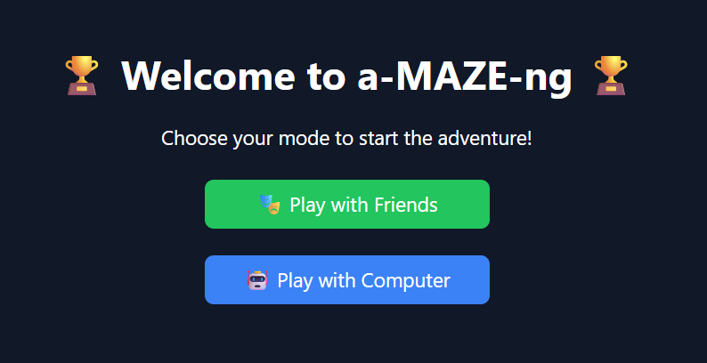
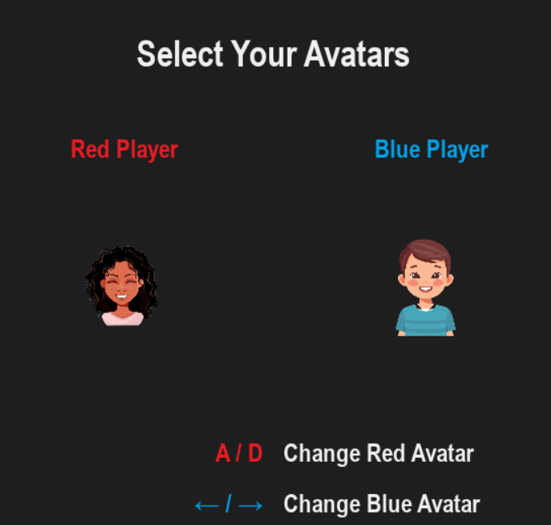
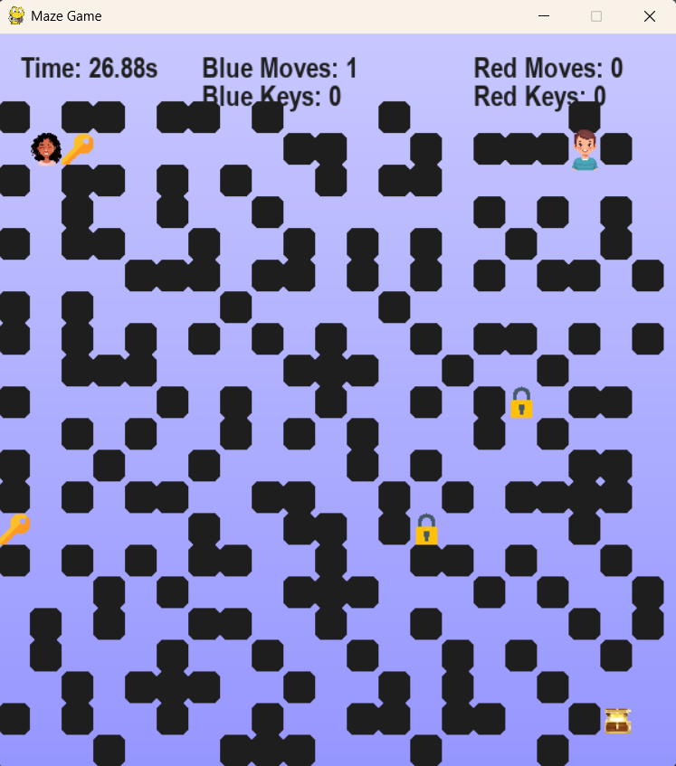
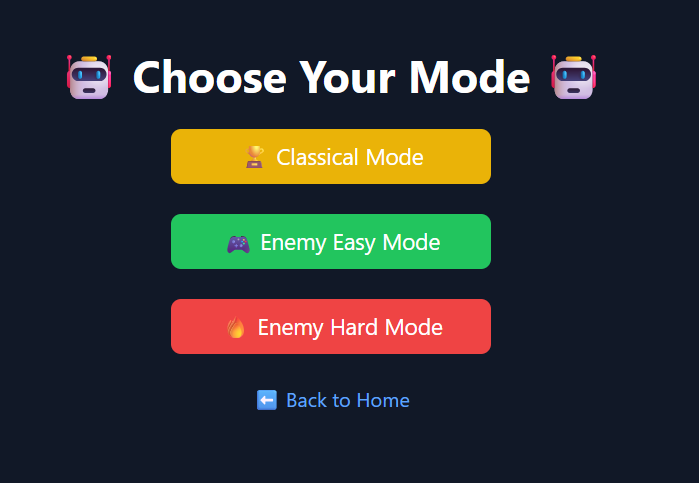

# **A-MAZE-ng - Treasure Hunt Maze Game⚡🙌**

**A-maze-ng** is an exciting maze adventure game developed using **Pygame**, where players navigate through a maze to reach the treasure. With two game modes — **Play with Friends** and **Play with Computer** — the game offers a thrilling challenge for everyone!

## **Table of Contents**
- [Gameplay](#gameplay)
  - [Play with Friends](#play-with-friends)
  - [Play with Computer](#play-with-computer)
- [Installation](#installation)
- [Running Locally](#running-locally)
- [Technologies Used](#technologies-used)
- [Contributing](#contributing)
- [License](#license)

---

## **Gameplay**

### **Play with Friends**
In **Play with Friends** mode, you and your friend can each choose an avatar and control your movement in the maze:
- **Player 1** uses the **Up, Down, Left, Right arrows** to move.
- **Player 2** uses the **W, A, S, D** keys to move.

The objective is simple: the first player to reach the treasure wins! It’s a race against time and your opponent.

### **Play with Computer**
In **Play with Computer** mode, there are three difficulty levels to choose from:
- **Classic Mode**: Navigate the maze without being chased.
- **Easy Mode**: You’ll be chased by a robot enemy, but it’s not too fast, giving you a fair chance to escape.
- **Hard Mode**: The robot enemy is faster and more aggressive. If it catches you, you lose!

Can you outsmart the robot and grab the treasure?

---

## **Installation**

To get started with the game, follow these steps to install the necessary dependencies:

1. **Make sure you have Python installed** on your machine.
   - Download Python from [python.org](https://www.python.org/downloads/) if it’s not installed already.

2. **Install the required Python libraries**:
   Open your terminal or command prompt and run the following commands:

   ```bash
   pip install pygame
   pip install numpy
   pip install flask
   ```

---

## **Running Locally**

1. **Clone the repository** to your local machine:
   ```bash
   git clone https://github.com/SWETHACS17/Treasure-Hunt-Maze.git
   ```

2. **Navigate to the project directory**:
   ```bash
   cd A-maze-ng
   ```

3. **Run the Flask server** to start the game locally:
   ```bash
   python server.py
   ```

4. **Open your browser** and go to `http://127.0.0.1:5000/` to start playing the game.

---

## **Technologies Used**

- **Python**: Programming language used to develop the game.
- **Pygame**: A set of Python modules used to create games, providing functionalities for graphics, sound, and user input.
- **Flask**: A micro web framework for Python, used to create the server and handle requests.
- **NumPy**: Used for mathematical operations and managing game-related data.

---
## Screenshots

### Home Page  


### Choose Your Avatars  


### Friends Mode Gameplay  


### Hard Mode in Play with Computer  



### Enjoy playing **A-maze-ng** and good luck reaching the treasure!
